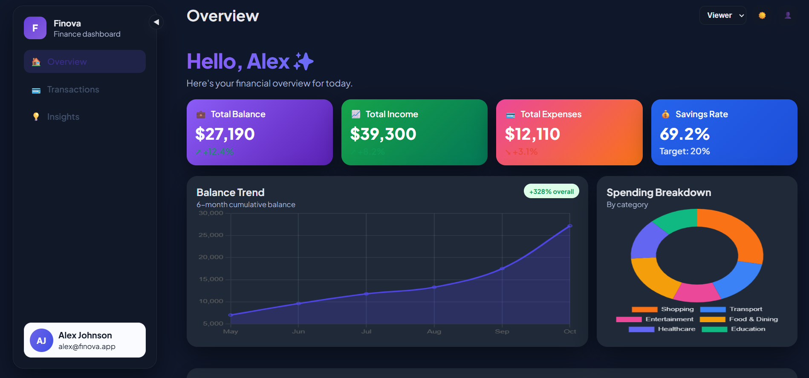
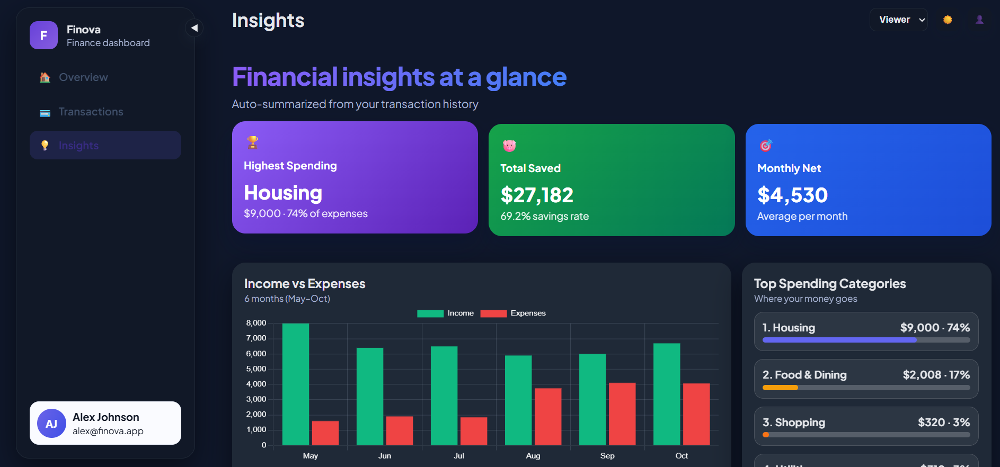
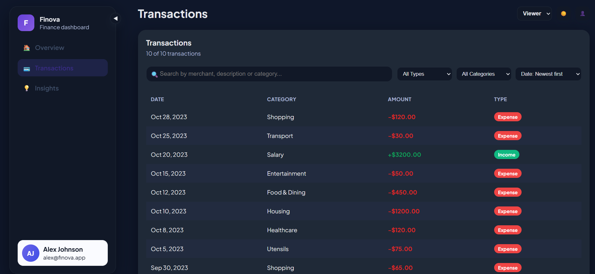

# 💰 Finova – Finance Dashboard (React)

A responsive finance dashboard built using React that allows users to track transactions, view insights, and interact with a clean, modern UI.

---

# 🚀 Features 

1️⃣ Dashboard Overview
- Summary cards:
  - Total Balance
  - Total Income
  - Total Expenses
- 📈 Time-based visualization (balance trend)
- 📊 Category-based visualization (spending breakdown)

---

2️⃣ Transactions Section
- Displays transaction list with:
  - Date
  - Amount
  - Category
  - Type (Income / Expense)

- Features:
  - 🔍 Search functionality
  - 🔽 Filter (Income / Expense)
  - ↕️ Sorting (by category)

---

3️⃣ Role-Based UI (Frontend Simulation)
- 👁️ Viewer:
  - Can only view data
- 🛠️ Admin:
  - Can add/edit transactions

- Role switching implemented using dropdown (frontend only)

---

4️⃣ Insights Section
- Highest spending category
- Monthly comparison
- Basic financial observations

---

5️⃣ State Management
- Managed using React Hooks:
  - Transactions data
  - Filters & search
  - Selected user role

---

6️⃣ UI & UX
- Clean and minimal design
- Fully responsive (mobile + desktop)
- Collapsible sidebar with hamburger menu
- Dark mode support
- Handles empty states gracefully

---

# 🛠️ Tech Stack

- React (Hooks)
- Tailwind CSS
- Chart.js / Recharts
- JavaScript (ES6+)

---

## ⚙️ Installation & Setup

```bash
# Clone the repository
git clone https://github.com/yashgurjar12/finova-dashboard.git

# Navigate to project folder
cd finova-dashboard

# Install dependencies
npm install

# Start development server
npm start
```

---

# 📸 Screenshots

🏠 Dashboard Overview


---

📊 Insights


---

💳 Transactions Section


---

